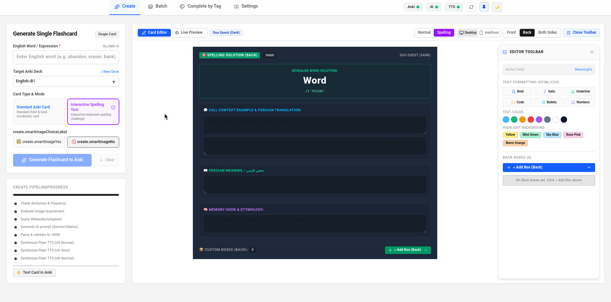
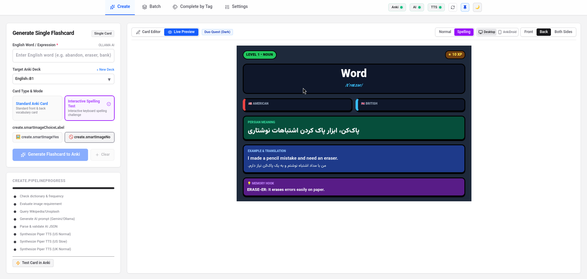

<div align="center">

# 🗂️ Flashcard Generator

### ساخت خودکار فلش‌کارت‌های حرفه‌ای Anki برای یادگیری زبان انگلیسی

تولید خودکار معنی، IPA، مثال، ترجمه، Memory Hook، تلفظ و تصویر
با پشتیبانی از **Ollama، Piper TTS و AnkiConnect**

<br>



<br><br>


<br><br>




</div>

---

## ✨ قابلیت‌ها

* 🧠 تولید اطلاعات لغت با AI
* 🤖 پشتیبانی از **Ollama** برای استفاده کاملاً آفلاین
* ☁️ پشتیبانی از Gemini و سرویس‌های OpenAI-Compatible
* 🔊 تولید تلفظ با **Piper TTS**
* 🇺🇸 تلفظ آمریکایی و 🇬🇧 بریتانیایی
* 📝 ساخت کارت‌های معمولی و Spelling
* 🖼️ جستجوی خودکار تصویر برای کلمات مناسب
* 📚 اتصال مستقیم به Anki با AnkiConnect
* 📦 پردازش تعداد زیادی لغت به صورت Batch
* 🌙 تم‌های مختلف برای کارت‌های Anki
* 🌐 رابط فارسی و انگلیسی

---

# 🚀 نصب و اجرا

دو روش برای اجرای برنامه وجود دارد:

1. **نسخه آماده AppImage در Linux**
2. **اجرای پروژه با Node.js در Windows و Linux**

---

# 🪟 نصب در Windows

## 1. نصب Node.js

ابتدا Node.js را از سایت رسمی دانلود و نصب کنید:

https://nodejs.org/en/download/

نسخه **LTS** را انتخاب کنید. صفحه رسمی Node.js در حال حاضر نسخه LTS را جداگانه مشخص می‌کند.

بعد از نصب، PowerShell یا Command Prompt را باز کنید و بررسی کنید:

```powershell
node --version
npm --version
```

اگر شماره نسخه نمایش داده شد، Node.js با موفقیت نصب شده است.

---

## 2. دریافت پروژه

مخزن پروژه:

https://github.com/Amin-naghdbishi/english-flashcard-generator

با Git:

```powershell
git clone https://github.com/Amin-naghdbishi/english-flashcard-generator.git
cd english-flashcard-generator
```

اگر Git ندارید، می‌توانید از صفحه GitHub گزینه:

**Code → Download ZIP**

را انتخاب کنید و فایل را Extract کنید.

---

## 3. نصب وابستگی‌ها

داخل پوشه پروژه اجرا کنید:

```powershell
npm install
```

این دستور تمام کتابخانه‌های مورد نیاز پروژه را نصب می‌کند.

---

## 4. اجرای برنامه

برای اجرای نسخه توسعه:

```powershell
npm run dev
```

یا اگر پروژه برای اجرای نسخه ساخته‌شده تنظیم شده است:

```powershell
npm run build
npm start
```

بعد از اجرا، آدرس نمایش داده‌شده در ترمینال را در مرورگر باز کنید.

معمولاً:

```text
http://localhost:3000
```

---

# 🐧 نصب در Linux

## روش سریع: AppImage

اگر فقط می‌خواهید از برنامه استفاده کنید و قصد توسعه ندارید، AppImage ساده‌ترین روش است.

از صفحه Releases آخرین نسخه را دریافت کنید:

https://github.com/Amin-naghdbishi/english-flashcard-generator/releases

بعد:

```bash
chmod +x Flashcard-Generator-*.AppImage
```

و اجرا کنید:

```bash
./Flashcard-Generator-*.AppImage
```

AppImage به Node.js پروژه نیاز ندارد.

> برای استفاده از قابلیت‌های آفلاین همچنان باید Ollama و Piper را جداگانه نصب کنید.

---

# 🐧 اجرای پروژه با Node.js در Linux

اگر می‌خواهید سورس پروژه را اجرا یا ویرایش کنید، ابتدا Node.js را نصب کنید.

سایت رسمی:

https://nodejs.org/en/download/

سپس:

```bash
git clone https://github.com/Amin-naghdbishi/english-flashcard-generator.git
cd english-flashcard-generator
npm install
npm run dev
```

برای اجرای نسخه نهایی:

```bash
npm run build
npm start
```

---

# 📴 حالت کاملاً آفلاین

برای استفاده بدون سرویس‌های ابری، دو برنامه لازم دارید:

* **Ollama** → تولید اطلاعات متنی لغات
* **Piper TTS** → تولید تلفظ صوتی

همچنین برای ذخیره کارت‌ها:

* **Anki + AnkiConnect**

ساختار کلی:

```text
                  Flashcard Generator
                                      │
              ┌──────────┴──────────┐
              │                                               │
           Ollama                                     Piper
          AI آفلاین                                TTS آفلاین
              │                                               │
              └──────────┬──────────┘
                                       │
                           AnkiConnect
                                       │
                                    Anki
```

---

# 🤖 نصب Ollama

## Linux

مستندات رسمی:

https://docs.ollama.com/linux

نصب:

```bash
curl -fsSL https://ollama.com/install.sh | sh
```

سپس بررسی کنید:

```bash
ollama --version
```

اگر سرویس به صورت خودکار اجرا نشد:

```bash
ollama serve
```

---

## دانلود مدل پیشنهادی

مدل پیشنهادی این پروژه:

```bash
ollama pull gemma3:4b
```

بررسی مدل‌های نصب‌شده:

```bash
ollama list
```

باید چیزی شبیه این ببینید:

```text
gemma3:4b
```

در Flashcard Generator نیز:

```text
Settings
→ AI Provider
→ Ollama
→ Model: gemma3:4b
```

سپس اتصال را آزمایش کنید.

---

# 🔊 نصب Piper TTS

Piper یک موتور تبدیل متن به گفتار محلی است و می‌تواند به صورت HTTP server روی پورت `5000` اجرا شود.

این بخش برای حالت آفلاین **اختیاری اما پیشنهادی** است.

## 1. ساخت محیط Python

Linux:

```bash
python3 -m venv ~/piper-env
source ~/piper-env/bin/activate
```

سپس:

```bash
pip install --upgrade pip
pip install "piper-tts[http]"
```

---

# 🎙️ دانلود صداهای Piper

این پروژه از دو صدای باکیفیت استفاده می‌کند:

### 🇺🇸 American English

`en_US-lessac-high`

### 🇬🇧 British English

`en_GB-cori-high`

هر دو Voice در مجموعه رسمی Piper Voices روی Hugging Face موجود هستند. Lessac با کیفیت `high` برای انگلیسی آمریکایی و Cori با کیفیت `high` برای انگلیسی بریتانیایی ارائه شده‌اند.

## دانلود مدل‌ها

ابتدا پوشه صداها را بسازید:

```bash
mkdir -p ~/piper-voices
cd ~/piper-voices
```

### 🇺🇸 Lessac

```bash
wget https://huggingface.co/rhasspy/piper-voices/resolve/main/en/en_US/lessac/high/en_US-lessac-high.onnx

wget https://huggingface.co/rhasspy/piper-voices/resolve/main/en/en_US/lessac/high/en_US-lessac-high.onnx.json
```

### 🇬🇧 Cori

```bash
wget https://huggingface.co/rhasspy/piper-voices/resolve/main/en/en_GB/cori/high/en_GB-cori-high.onnx

wget https://huggingface.co/rhasspy/piper-voices/resolve/main/en/en_GB/cori/high/en_GB-cori-high.onnx.json
```

بررسی:

```bash
ls -lh ~/piper-voices
```

باید چهار فایل داشته باشید:

```text
en_US-lessac-high.onnx
en_US-lessac-high.onnx.json

en_GB-cori-high.onnx
en_GB-cori-high.onnx.json
```

---

# 🌐 اجرای Piper به صورت Server

برای اجرای Piper:

```bash
source ~/piper-env/bin/activate
```

سپس:

```bash
python3 -m piper.http_server \
  --model ~/piper-voices/en_US-lessac-high.onnx \
  --data-dir ~/piper-voices \
  --port 5000
```

سرور باید روی این آدرس اجرا شود:

```text
http://127.0.0.1:5000
```

تست:

```bash
curl http://127.0.0.1:5000/voices
```

Piper API رسمی نیز `/voices` را برای مشاهده Voiceهای موجود و `/synthesize` را برای تولید WAV ارائه می‌کند.

---

# ⚙️ اجرای Piper به صورت سرویس systemd

اگر نمی‌خواهید هر بار Piper را دستی اجرا کنید، می‌توانید آن را به سرویس دائمی Linux تبدیل کنید.

فایل سرویس را بسازید:

```bash
sudo nano /etc/systemd/system/piper.service
```

این محتوا را قرار دهید:

```ini
[Unit]
Description=Piper TTS Server
After=network.target

[Service]
Type=simple
User=%i
ExecStart=%h/piper-env/bin/python -m piper.http_server --model %h/piper-voices/en_US-lessac-high.onnx --data-dir %h/piper-voices --port 5000
Restart=always
RestartSec=3

[Install]
WantedBy=default.target
```

> اگر این روش با نسخه systemd شما مناسب نبود، می‌توانید `User=%i` را حذف کرده و نام کاربری خودتان را مستقیماً قرار دهید.

سپس:

```bash
systemctl --user daemon-reload
systemctl --user enable --now piper.service
```

وضعیت:

```bash
systemctl --user status piper.service
```

مشاهده لاگ:

```bash
journalctl --user -u piper.service -f
```

تست:

```bash
curl http://127.0.0.1:5000/voices
```

اگر JSON دریافت کردید، Piper فعال است.

---

# 🇺🇸🇬🇧 استفاده همزمان از American و British

برای اینکه برنامه بتواند هر دو صدا را استفاده کند، هر دو Voice را در:

```text
~/piper-voices/
```

قرار دهید.

در تنظیمات Flashcard Generator:

```text
TTS Engine: Piper
Server: http://127.0.0.1:5000

American Voice:
en_US-lessac-high

British Voice:
en_GB-cori-high
```

برای سرعت آهسته‌تر نیز برنامه می‌تواند از `length_scale` بالاتر استفاده کند؛ مقدار پیش‌فرض Piper برابر `1` است.

---

# 🃏 نصب Anki

Anki را از سایت رسمی دریافت کنید:

https://apps.ankiweb.net/

Anki را نصب و اجرا کنید.

---

# 🔌 نصب AnkiConnect

Flashcard Generator برای ارسال مستقیم کارت‌ها به Anki به **AnkiConnect** نیاز دارد.

در Anki:

```text
Tools
→ Add-ons
→ Get Add-ons
```

کد زیر را وارد کنید:

```text
2055492159
```

پس از نصب، **Anki را کاملاً ببندید و دوباره اجرا کنید.**

AnkiConnect یک افزونه برای ارائه API به برنامه‌های دیگر است؛ مخزن قدیمی GitHub آن در سال 2025 آرشیو شده و پروژه به SourceHut منتقل شده است.

---

# 🧪 آزمایش AnkiConnect

وقتی Anki باز است، در Linux می‌توانید اجرا کنید:

```bash
curl -s http://127.0.0.1:8765 \
  -X POST \
  -H "Content-Type: application/json" \
  -d '{"action":"version","version":6}'
```

اگر همه‌چیز درست باشد، نتیجه‌ای مشابه زیر دریافت می‌کنید:

```json
{"result":6,"error":null}
```

اگر چنین پاسخی دریافت کردید، اتصال آماده است.

---

# ⚙️ تنظیم Flashcard Generator

پس از نصب سرویس‌ها، برنامه را اجرا کنید.

در Settings:

## AI

برای حالت آفلاین:

```text
Provider: Ollama
URL: http://127.0.0.1:11434
Model: gemma3:4b
```

## TTS

```text
Engine: Piper
URL: http://127.0.0.1:5000

American:
en_US-lessac-high

British:
en_GB-cori-high
```

## Anki

```text
URL: http://127.0.0.1:8765
```

---

# 📝 ساخت اولین کارت

به بخش:

```text
Create Card
```

بروید.

مثلاً بنویسید:

```text
readability
```

سپس:

```text
Generate Flashcard
```

برنامه اطلاعات کارت را تولید کرده و آن را مستقیماً در Anki قرار می‌دهد.

نمونه اطلاعات تولیدشده:

```text
Word:
readability

Phonetic:
/ˌriːdəˈbɪləti/

Meaning:
خوانایی، سهولت خوانده شدن

Example:
The readability of this book is excellent.

Memory Hook:
read + ability
```

---

# 📦 ساخت چند کارت به صورت همزمان

برای تعداد زیادی لغت می‌توانید از Batch Processing استفاده کنید.

نمونه:

```text
Word=abandon
Deck=English::Vocabulary
--
Word=hesitate
Deck=English::Vocabulary
--
Word=readability
Deck=English::Vocabulary
```

برنامه هر بلوک را به یک کارت جداگانه تبدیل می‌کند.

---

# 🛠️ عیب‌یابی سریع

## برنامه اجرا نمی‌شود

بررسی Node.js:

```bash
node --version
npm --version
```

سپس:

```bash
npm install
npm run dev
```

---

## Ollama کار نمی‌کند

بررسی:

```bash
ollama list
```

یا:

```bash
curl http://127.0.0.1:11434
```

اگر Ollama اجرا نیست:

```bash
ollama serve
```

---

## Piper کار نمی‌کند

بررسی:

```bash
curl http://127.0.0.1:5000/voices
```

اگر پاسخی دریافت نشد:

```bash
systemctl --user status piper.service
```

و لاگ:

```bash
journalctl --user -u piper.service -f
```

---

## AnkiConnect کار نمی‌کند

اول مطمئن شوید Anki باز است.

سپس:

```bash
curl -s http://127.0.0.1:8765 \
  -X POST \
  -H "Content-Type: application/json" \
  -d '{"action":"version","version":6}'
```

اگر `result: 6` دریافت نشد، AnkiConnect را بررسی و Anki را Restart کنید.

---

# 🔐 حالت‌های استفاده

### ☁️ آنلاین

```text
Flashcard Generator
        ↓
Google Gemini / Custom AI
        ↓
Piper یا Online TTS
        ↓
Anki
```

### 📴 کاملاً آفلاین

```text
Flashcard Generator
        ↓
Ollama
        ↓
Piper TTS
        ↓
AnkiConnect
        ↓
Anki
```

در حالت دوم، تولید متن و صوت روی کامپیوتر خودتان انجام می‌شود و برای این بخش‌ها نیازی به API ابری ندارید.

---

# 📚 لینک‌های مهم

* **Project:** https://github.com/Amin-naghdbishi/english-flashcard-generator
* **Releases:** https://github.com/Amin-naghdbishi/english-flashcard-generator/releases
* **Node.js:** https://nodejs.org/en/download/
* **Ollama:** https://ollama.com/
* **Ollama Linux Documentation:** https://docs.ollama.com/linux
* **Piper Voices:** https://huggingface.co/rhasspy/piper-voices
* **Anki:** https://apps.ankiweb.net/
* **AnkiConnect:** https://github.com/FooSoft/anki-connect

---

<div>

# 🗂️ Flashcard Generator

### Automatically create professional Anki flashcards for learning English

Automatically generate meanings, IPA, examples, translations, memory hooks, pronunciations, and images
with support for **Ollama, Piper TTS, and AnkiConnect**

---

## ✨ Features

* 🧠 Generate vocabulary information using AI
* 🤖 **Ollama** support for fully offline use
* ☁️ Support for Gemini and OpenAI-compatible services
* 🔊 Generate pronunciations with **Piper TTS**
* 🇺🇸 American and 🇬🇧 British English pronunciation
* 📝 Create standard and spelling cards
* 🖼️ Automatically search for images when appropriate
* 📚 Direct integration with Anki using AnkiConnect
* 📦 Batch processing for large numbers of words
* 🌙 Multiple themes for Anki cards
* 🌐 Persian and English interface

---

# 🚀 Installation & Usage

There are two ways to run the application:

1. **Pre-built AppImage on Linux**
2. **Run the project with Node.js on Windows or Linux**

---

# 🪟 Installation on Windows

## 1. Install Node.js

First, download and install Node.js from the official website:

https://nodejs.org/en/download/

Choose the **LTS** version.

After installation, open PowerShell or Command Prompt and verify the installation:

```powershell
node --version
npm --version
```

If version numbers are displayed, Node.js has been installed successfully.

---

## 2. Get the Project

Project repository:

https://github.com/Amin-naghdbishi/english-flashcard-generator

Using Git:

```powershell
git clone https://github.com/Amin-naghdbishi/english-flashcard-generator.git
cd english-flashcard-generator
```

If you don't have Git installed, open the GitHub repository and select:

**Code → Download ZIP**

Then extract the downloaded ZIP file.

---

## 3. Install Dependencies

Open a terminal inside the project folder and run:

```powershell
npm install
```

This will install all the dependencies required by the project.

---

## 4. Run the Application

To run the development version:

```powershell
npm run dev
```

Or, if you want to run the production build:

```powershell
npm run build
npm start
```

After starting the application, open the URL shown in the terminal in your browser.

Usually:

```text
http://localhost:3000
```

---

# 🐧 Installation on Linux

## Quick Method: AppImage

If you only want to use the application and don't need to modify the source code, the AppImage is the easiest option.

Download the latest release from the Releases page:

https://github.com/Amin-naghdbishi/english-flashcard-generator/releases

Then make the AppImage executable:

```bash
chmod +x Flashcard-Generator-*.AppImage
```

Run it:

```bash
./Flashcard-Generator-*.AppImage
```

The AppImage does not require Node.js.

> To use the offline features, you still need to install Ollama and Piper separately.

---

# 🐧 Run from Source with Node.js on Linux

If you want to run or modify the project source code, install Node.js first.

Official website:

https://nodejs.org/en/download/

Then:

```bash
git clone https://github.com/Amin-naghdbishi/english-flashcard-generator.git
cd english-flashcard-generator
npm install
npm run dev
```

To run the production version:

```bash
npm run build
npm start
```

---

# 📴 Fully Offline Mode

To use the application without cloud services, you need two additional components:

* **Ollama** → Generates vocabulary information locally
* **Piper TTS** → Generates pronunciation audio locally

You will also need:

* **Anki + AnkiConnect** → Stores the generated flashcards

Overall architecture:

```text
                  Flashcard Generator
                                      │
              ┌──────────┴──────────┐
              │                     │
           Ollama                 Piper
        Offline AI            Offline TTS
              │                     │
              └──────────┬──────────┘
                         │
                    AnkiConnect
                         │
                        Anki
```

---

# 🤖 Install Ollama

## Linux

Official documentation:

https://docs.ollama.com/linux

Install Ollama:

```bash
curl -fsSL https://ollama.com/install.sh | sh
```

Then verify the installation:

```bash
ollama --version
```

If the Ollama service does not start automatically:

```bash
ollama serve
```

---

## Download the Recommended Model

The recommended model for this project is:

```bash
ollama pull gemma3:4b
```

Check the installed models:

```bash
ollama list
```

You should see something similar to:

```text
gemma3:4b
```

In Flashcard Generator, select:

```text
Settings
→ AI Provider
→ Ollama
→ Model: gemma3:4b
```

Then test the connection.

---

# 🔊 Install Piper TTS

Piper is a local text-to-speech engine that can run as an HTTP server on port `5000`.

This step is **optional but recommended** for offline use.

## 1. Create a Python Environment

On Linux:

```bash
python3 -m venv ~/piper-env
source ~/piper-env/bin/activate
```

Then:

```bash
pip install --upgrade pip
pip install "piper-tts[http]"
```

---

# 🎙️ Download Piper Voices

This project uses two high-quality voices:

### 🇺🇸 American English

`en_US-lessac-high`

### 🇬🇧 British English

`en_GB-cori-high`

Both voices are available in the official Piper Voices collection on Hugging Face.

## Download the Models

First, create a directory for the voices:

```bash
mkdir -p ~/piper-voices
cd ~/piper-voices
```

### 🇺🇸 Lessac

```bash
wget https://huggingface.co/rhasspy/piper-voices/resolve/main/en/en_US/lessac/high/en_US-lessac-high.onnx

wget https://huggingface.co/rhasspy/piper-voices/resolve/main/en/en_US/lessac/high/en_US-lessac-high.onnx.json
```

### 🇬🇧 Cori

```bash
wget https://huggingface.co/rhasspy/piper-voices/resolve/main/en/en_GB/cori/high/en_GB-cori-high.onnx

wget https://huggingface.co/rhasspy/piper-voices/resolve/main/en/en_GB/cori/high/en_GB-cori-high.onnx.json
```

Verify the downloaded files:

```bash
ls -lh ~/piper-voices
```

You should have these four files:

```text
en_US-lessac-high.onnx
en_US-lessac-high.onnx.json

en_GB-cori-high.onnx
en_GB-cori-high.onnx.json
```

---

# 🌐 Run Piper as a Server

Activate the Piper environment:

```bash
source ~/piper-env/bin/activate
```

Then start the server:

```bash
python3 -m piper.http_server \
  --model ~/piper-voices/en_US-lessac-high.onnx \
  --data-dir ~/piper-voices \
  --port 5000
```

The server should now be available at:

```text
http://127.0.0.1:5000
```

Test it:

```bash
curl http://127.0.0.1:5000/voices
```

---

# ⚙️ Run Piper as a systemd Service

If you don't want to start Piper manually every time, you can run it as a persistent Linux service.

Create the service file:

```bash
sudo nano /etc/systemd/system/piper.service
```

Add:

```ini
[Unit]
Description=Piper TTS Server
After=network.target

[Service]
Type=simple
User=%i
ExecStart=%h/piper-env/bin/python -m piper.http_server --model %h/piper-voices/en_US-lessac-high.onnx --data-dir %h/piper-voices --port 5000
Restart=always
RestartSec=3

[Install]
WantedBy=default.target
```

Then run:

```bash
systemctl --user daemon-reload
systemctl --user enable --now piper.service
```

Check the service status:

```bash
systemctl --user status piper.service
```

View the logs:

```bash
journalctl --user -u piper.service -f
```

Test the server:

```bash
curl http://127.0.0.1:5000/voices
```

If you receive a JSON response, Piper is running correctly.

---

# 🇺🇸🇬🇧 Using American and British Voices

To allow the application to use both voices, keep both voice files in:

```text
~/piper-voices/
```

In Flashcard Generator settings:

```text
TTS Engine: Piper
Server: http://127.0.0.1:5000

American Voice:
en_US-lessac-high

British Voice:
en_GB-cori-high
```

For slower pronunciation, the application can use a higher `length_scale` value. Piper's default value is `1`.

---

# 🃏 Install Anki

Download Anki from the official website:

https://apps.ankiweb.net/

Install and launch Anki.

---

# 🔌 Install AnkiConnect

Flashcard Generator uses **AnkiConnect** to send generated cards directly to Anki.

In Anki, go to:

```text
Tools
→ Add-ons
→ Get Add-ons
```

Enter the following code:

```text
2055492159
```

After installing the add-on, **completely close Anki and launch it again.**

---

# 🧪 Test AnkiConnect

With Anki running, you can test AnkiConnect on Linux with:

```bash
curl -s http://127.0.0.1:8765 \
  -X POST \
  -H "Content-Type: application/json" \
  -d '{"action":"version","version":6}'
```

If everything is working correctly, you should receive:

```json
{"result":6,"error":null}
```

If you receive this response, AnkiConnect is ready to use.

---

# ⚙️ Configure Flashcard Generator

After installing the required services, launch the application.

Open **Settings**.

## AI

For offline use:

```text
Provider: Ollama
URL: http://127.0.0.1:11434
Model: gemma3:4b
```

## TTS

```text
Engine: Piper
URL: http://127.0.0.1:5000

American:
en_US-lessac-high

British:
en_GB-cori-high
```

## Anki

```text
URL: http://127.0.0.1:8765
```

---

# 📝 Create Your First Flashcard

Go to:

```text
Create Card
```

Enter a word, for example:

```text
readability
```

Then select:

```text
Generate Flashcard
```

The application will generate the card information and send it directly to Anki.

Example generated content:

```text
Word:
readability

Phonetic:
/ˌriːdəˈbɪləti/

Meaning:
the ease with which something can be read

Example:
The readability of this book is excellent.

Memory Hook:
read + ability
```

---

# 📦 Create Multiple Cards at Once

You can use Batch Processing to generate a large number of flashcards at once.

Example:

```text
Word=abandon
Deck=English::Vocabulary
--
Word=hesitate
Deck=English::Vocabulary
--
Word=readability
Deck=English::Vocabulary
```

The application will convert each block into a separate flashcard.

---

# 🛠️ Quick Troubleshooting

## The Application Does Not Start

Check Node.js:

```bash
node --version
npm --version
```

Then:

```bash
npm install
npm run dev
```

---

## Ollama Is Not Working

Check the installed models:

```bash
ollama list
```

Or test the server:

```bash
curl http://127.0.0.1:11434
```

If Ollama is not running:

```bash
ollama serve
```

---

## Piper Is Not Working

Check the Piper server:

```bash
curl http://127.0.0.1:5000/voices
```

If you don't receive a response:

```bash
systemctl --user status piper.service
```

View the logs:

```bash
journalctl --user -u piper.service -f
```

---

## AnkiConnect Is Not Working

First, make sure Anki is running.

Then test:

```bash
curl -s http://127.0.0.1:8765 \
  -X POST \
  -H "Content-Type: application/json" \
  -d '{"action":"version","version":6}'
```

If you do not receive `result: 6`, check your AnkiConnect installation and restart Anki.

---

# 🔐 Usage Modes

### ☁️ Online

```text
Flashcard Generator
        ↓
Google Gemini / Custom AI
        ↓
Piper or Online TTS
        ↓
Anki
```

### 📴 Fully Offline

```text
Flashcard Generator
        ↓
Ollama
        ↓
Piper TTS
        ↓
AnkiConnect
        ↓
Anki
```

In fully offline mode, text and audio generation are performed locally on your computer, so no cloud API is required for these features.

---

# 📚 Important Links

* **Project:** https://github.com/Amin-naghdbishi/english-flashcard-generator
* **Releases:** https://github.com/Amin-naghdbishi/english-flashcard-generator/releases
* **Node.js:** https://nodejs.org/en/download/
* **Ollama:** https://ollama.com/
* **Ollama Linux Documentation:** https://docs.ollama.com/linux
* **Piper Voices:** https://huggingface.co/rhasspy/piper-voices
* **Anki:** https://apps.ankiweb.net/
* **AnkiConnect:** https://github.com/FooSoft/anki-connect

---

### ❤️ Built to make learning English with Anki easier

If you encounter a problem, please report it in the [Issues section](https://github.com/Amin-naghdbishi/english-flashcard-generator/issues) of the project.

