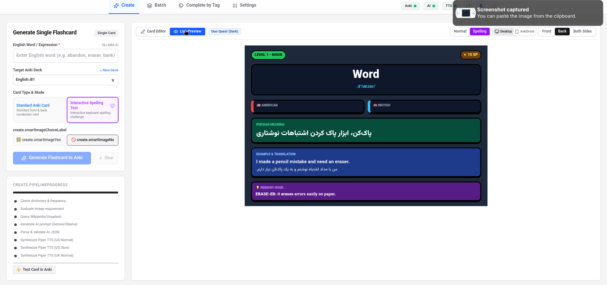
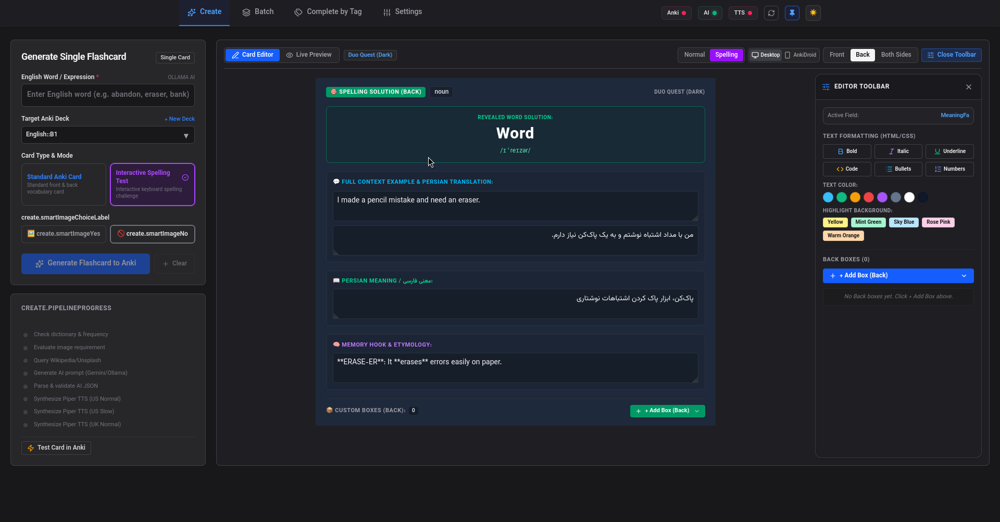
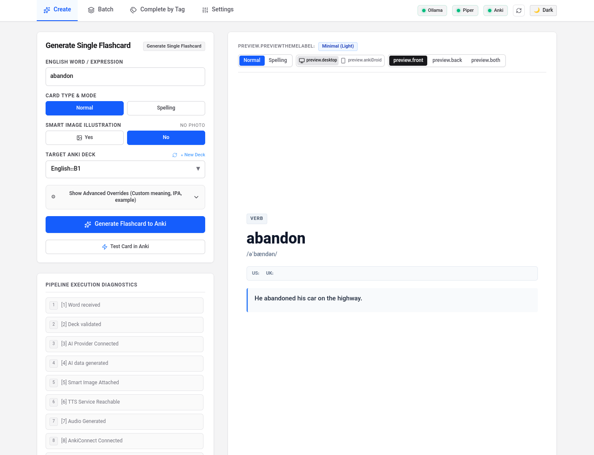
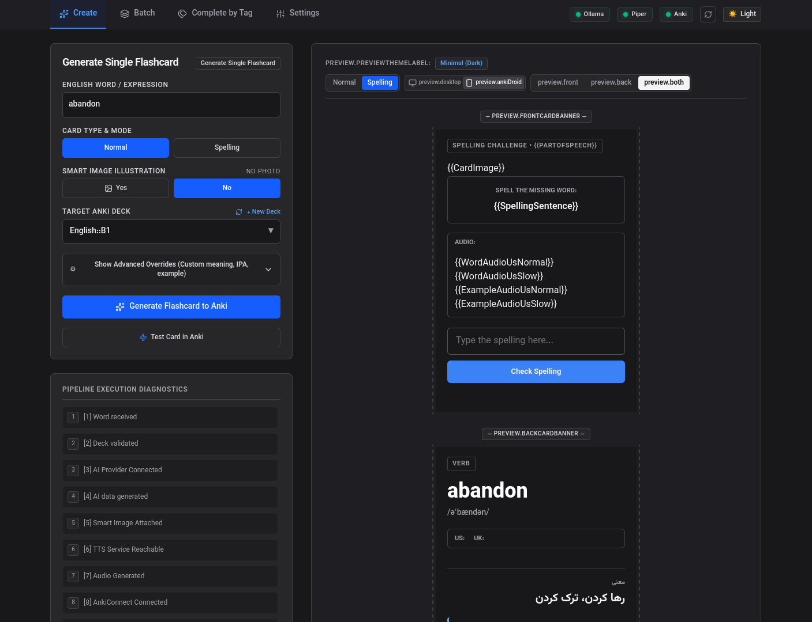

<div align="center">



<br><br>



# 🗂️ راهنمای جامع و دفترچه راهنمای فارسی Flashcard Generator
### نرم‌افزار حرفه‌ای، سریع و هوشمند ساخت خودکار فلش‌کارت‌های زبان انگلیسی برای Anki

[](https://github.com/Amin-naghdbishi/english-flashcard-generator/releases/tag/v1.0.5)
[]()
[](LICENSE)
[]()

</div>

---

نرم‌افزار **Flashcard Generator** یک سامانه پیشرفته و همه‌جانبه برای زبان‌آموزان است که وظیفه سخت، خسته‌کننده و زمان‌بر ساخت فلش‌کارت در **Anki** را به یک فرآیند خودکار و لذت‌بخش در کسری از ثانیه تبدیل می‌کند. 

این برنامه با ترکیب **مدل‌های هوش مصنوعی زبانی (محلی با Ollama یا ابری با Google Gemini و Custom AI)**، **موتور تبدیل متن به گفتار باکیفیت و آفلاین (Piper TTS)**، **سیستم تفکیک ریشه و کدینگ واژگان (Memory Hook)**، **جستجوگر هوشمند تصویر** و **۱۲ تم بصری زیبا همراه با آزمون املا (Spelling)**، تمامی فیلدهای مورد نیاز یک فلش‌کارت بی‌نقص را آماده کرده و بدون نیاز به کپی-پیست مستقیم وارد نرم‌افزار Anki شما می‌کند.

---

## 📑 فهرست مطالب

1. [معرفی برنامه و قابلیت‌های کلیدی](#section-1)
2. [معماری و نحوه کارکرد سیستم](#section-2)
3. [پیش‌نیازها و اصطلاحات پایه‌ای برای مبتدیان](#section-3)
4. [روش‌های اجرا: نسخه مستقل AppImage در برابر اجرای سورس‌کد](#section-4)
5. [راهنمای گام‌به‌گام «شروع از صفر» (۱۴ مرحله متوالی)](#section-5)
6. [مستندات کامل هوش مصنوعی محلی (Ollama)](#section-6)
7. [مستندات ارائه‌دهنده‌های هوش مصنوعی آنلاین و ابری](#section-7)
8. [مستندات سیستم صوتی و تبدیل متن به گفتار (TTS)](#section-8)
9. [راهنمای جامع Anki و AnkiConnect](#section-9)
10. [فرمت‌های فایل متنی برای ساخت دسته‌ای (فرمت A و فرمت B)](#section-10)
11. [بررسی و آموزش قابلیت‌های پیشرفته برنامه](#section-11)
12. [۱۰ مثال واقعی و ملموس از ساخت کارت‌ها](#section-12)
13. [راهنمای جامع عیب‌یابی و حل مشکلات (Troubleshooting)](#section-13)
14. [تصاویر و راهنمای بصری رابط کاربری](#section-14)
15. [راهنمای جامع تنظیمات و فایل پیکربندی](#section-15)
16. [امنیت و محافظت از کلیدهای API](#section-16)
17. [پیشنهاد سرویس‌های آنلاین برتر](#section-17)
18. [پرسش‌های متداول (FAQ)](#section-18)
19. [وضعیت کنونی پروژه، محدودیت‌ها و نقشه راه](#section-19)

---

<span id="section-1"></span>
## ۱. معرفی برنامه و قابلیت‌های کلیدی

### این برنامه چه مشکلی را حل می‌کند؟
روش **تکرار فاصله‌دار (Spaced Repetition System / SRS)** در نرم‌افزار Anki اثبات‌شده‌ترین روش برای به‌خاطرسپاری دائمی لغات است. اما ساخت یک فلش‌کارت باکیفیت و استاندارد نیازمند صرف وقت فراوان است:
- پیدا کردن و تایپ نماد بین‌المللی فونتیک (IPA) و نقش دستوری (Part of Speech).
- یافتن ترجمه و معنی دقیق و فارسی روان.
- نوشتن یک جمله مثال انگلیسی آموزنده متناسب با سطح زبان‌آموز.
- ترجمه دقیق جمله مثال به فارسی طبیعی و معاصر.
- ضبط یا دانلود فایل‌های تلفظ باکیفیت با لهجه آمریکایی و بریتانیایی.
- ایجاد یک تکنیک یادسپاری، ریشه‌شناسی و بخش‌بندی کلمه (Memory Hook).
- پیدا کردن تصویر واضح و متناسب.
- قالب‌بندی و چیدمان ظاهری زیبا در Anki.

انجام دستی این کار برای هر لغت بین ۵ تا ۱۰ دقیقه طول می‌کشد. **Flashcard Generator** تمامی این مراحل را در کمتر از ۳ ثانیه برای هر کارت به صورت هوشمند و بدون دخالت دست انجام می‌دهد!

### مهم‌ترین قابلیت‌های نرم‌افزار:
* **تولید محتوای متنی با هوش مصنوعی:** تولید معنی فارسی، فونتیک، نقش دستوری، جمله مثال انگلیسی، ترجمه مثال و کد یادسپاری.
* **کدینگ و یادافزای هوشمند (Memory Hook با تفکیک ریخت‌شناسی):** تفکیک کلمات مرکب و مشتق به اجزای سازنده (مانند `readability → read + ability`) و توضیح تک‌تک بخش‌ها به فارسی، همراه با رفتار هوشمند در برابر کلمات پایه ساده (بدون خرد کردن غیرواقعی کلمات ساده مثل `apple`).
* **تنظیمات پرامپت‌های پیش‌فرض هوش مصنوعی (AI Default Prompts):** امکان مشاهده، ویرایش، شخصی‌سازی و بازگردانی کلی و جزئی دستورالعمل‌های ارسالی به مدل‌های زبانی از طریق رابط گرافیکی Settings با دکمه اختصاصی **Restore Defaults**.
* **تلفظ صوتی دوگانه و تنظیم سرعت با Piper TTS:** تولید فایل‌های صوتی استاندارد با دو لهجه آمریکایی (US) و بریتانیایی (UK) در دو سرعت عادی (Normal) و آهسته و شمرده (Slow).
* **سیستم هوشمند گزینش تصویر (Smart Images):** جستجوی تصویر مرتبط و تشخیص هوشمند اینکه آیا واژه ماهیت فیزیکی دارد (مانند `telescope`) یا انتزاعی است (مانند `freedom`).
* **پشتیبانی همزمان از ۲ نوع کارت:** کارت‌های معمولی آموزشی (Normal) و کارت‌های تایپی آزمون املا (Spelling) با بررسی دقیق صحت حروف.
* **۱۲ تم گرافیکی جذاب:** دارای ۶ تم روشن و ۶ تم تاریک با استایل‌های مدرن، سایبرپانک، مینیمال، دراکولا و کمیک.
* **ساخت گروهی و دسته‌ای (Batch Processing):** پردازش همزمان صدها واژه از روی فایل‌های متنی ساختاریافته همراه با نوار پیشرفت درصدی زنده و قابلیت توقف/ادامه.
* **تکمیل هوشمند کارت‌های ناقص با تگ (Complete by Tag):** اسکن کارت‌های موجود در Anki بر اساس برچسب و پر کردن فیلدهای ناقص بدون تغییر دستکاری‌های قبلی کاربر.
* **پشتیبانی از ارائه‌دهنده‌های گوناگون AI:** اتصال به Ollama محلی، Google Gemini ابری و سرورهای سفارشی سازگار با OpenAI (مثل OpenRouter، DeepSeek، Groq و vLLM).
* **دو زبانه و چیدمان مستقل:** امکان انتخاب زبان رابط کاربری (فارسی / انگلیسی) و جهت نمایش (RTL / LTR) به صورت کاملاً مستقل.

---

<span id="section-2"></span>
## ۲. معماری و نحوه کارکرد سیستم

این دیاگرام نشان می‌دهد داده‌ها چگونه بین مرورگر، سرور نرم‌افزار، هوش مصنوعی، موتور صوتی و نرم‌افزار Anki رد و بدل می‌شوند:

```text
       ┌───────────────────────────────────────────────────────────┐
       │                رابط کاربری در مرورگر                      │
       │     (ساخت تک‌کارت / پردازش دسته‌ای / تنظیمات / پیش‌نمایش)      │
       └─────────────────────────────┬─────────────────────────────┘
                                     │ درخواست HTTP / JSON
                                     ▼
       ┌───────────────────────────────────────────────────────────┐
       │             هسته سرور برنامه (Node.js Core)               │
       │    (ترکیب پرامپت‌های متمرکز، مدیریت تنظیمات، اعتبارسنجی)      │
       └──────┬──────────────────────┼──────────────────────┬──────┘
              │                      │                      │
              ▼                      ▼                      ▼
     ┌────────────────┐    ┌──────────────────┐    ┌─────────────────┐
     │ ماژول هوش      │    │  ماژول صوتی      │    │ جستجوی تصویر     │
     │ مصنوعی (AI)    │    │  (TTS Module)    │    │ (Smart Images)  │
     └────────┬───────┘    └────────┬─────────┘    └────────┬────────┘
              │                     │                       │
      ┌───────┴───────┐     ┌───────┴────────┐              │
      ▼               ▼     ▼                ▼              ▼
 ┌─────────┐    ┌────────┐ ┌─────────┐ ┌──────────┐ ┌────────────────┐
 │ Ollama  │    │ Gemini │ │  Piper  │ │ Online   │ │ Wikimedia /    │
 │ (محلی)  │    │ (ابری) │ │ (محلی)  │ │ (ابری)   │ │ Unsplash       │
 └─────────┘    └────────┘ └─────────┘ └──────────┘ └────────────────┘
              │                     │                       │
              └──────────────┬──────┴───────────────────────┘
                             │ داده‌های نهایی (متن + صوت + تصویر)
                             ▼
       ┌───────────────────────────────────────────────────────────┐
       │              افزونه AnkiConnect (پورت 8765)                │
       └─────────────────────────────┬─────────────────────────────┘
                                     │ ذخیره در کالکشن
                                     ▼
       ┌───────────────────────────────────────────────────────────┐
       │               نرم‌افزار Anki Desktop کامپیوتر               │
       │     (ایجاد کارت استاندارد در دسته هدف + ذخیره مدیاها)     │
       └───────────────────────────────────────────────────────────┘
```

### وظیفه هر لایه:
1. **Frontend (رابط کاربری وب):** ساخته شده با React، TypeScript و Tailwind CSS. فرم‌ها را مدیریت می‌کند، پیش‌نمایش زنده کارت را نشان می‌دهد و امکان پخش صوت و بررسی املا را قبل و بعد از ذخیره فراهم می‌سازد.
2. **Backend Server:** سرور سبک و سریع که درخواست‌ها را مدیریت می‌کند، پرامپت‌های پیش‌فرض و سفارشی را سرهم می‌کند و اتصال با سرویس‌های دیگر را برقرار نگه می‌دارد.
3. **AI Engine:** متن کلمه را دریافت می‌کند و بسته به انتخاب کاربر (Ollama یا Gemini)، ساختار JSON حاوی معنی، فونتیک، مثال، ترجمه و یادافزا را بازمی‌گرداند.
4. **TTS Engine:** کلمه و جمله مثال را با سرعت معمولی و آرام به فایل‌های صوتی استاندارد WAV تبدیل می‌کند.
5. **AnkiConnect:** پلی ارتباطی میان برنامه و پایگاه‌داده Anki؛ کارت‌ها، فایل‌های صوتی و عکس‌ها را بدون نیاز به بستن Anki مستقیماً درون دسته ثبت می‌کند.

---

<span id="section-3"></span>
## ۳. پیش‌نیازها و اصطلاحات پایه‌ای برای مبتدیان

اگر تا کنون برنامه‌نویسی نکرده‌اید یا با لینوکس کار نکرده‌اید، جای هیچ نگرانی نیست! در این بخش تمام ابزارهای مورد نیاز را از صفر به زبانی ساده یاد می‌گیرید:

### اصطلاحات و ابزارها به زبان ساده:
* **ترمینال (Terminal / Command Line):** پنجره‌ای متنی در سیستم‌عامل که در آن به جای کلیک با ماوس، دستورات را تایپ می‌کنید و کلید Enter را می‌زنید. در لینوکس با فشردن کلیدهای `Ctrl + Alt + T` باز می‌شود.
* **گیت (Git):** ابزاری برای دریافت کدهای برنامه از اینترنت (گیت‌هاب) به رایانه شما.
* **نود.جی‌اس (Node.js):** محیطی برای اجرای کدهای جاوااسکریپت و تایپ‌اسکریپت روی سیستم‌عامل.
* **ان‌پی‌ام (npm):** ابزار مدیریت پکیج‌ها در Node.js که کتابخانه‌ها و فایل‌های پیش‌نیاز پروژه را به صورت خودکار دانلود و نصب می‌کند.
* **پایتون (Python):** زبانی که برای راه‌اندازی و اجرای موتور صوتی محلی Piper TTS به کار می‌رود.
* **پیپ (pip):** ابزار مدیریت کتابخانه‌های پایتون.
* **محیط مجازی (Virtual Environment یا venv):** فضایی ایزوله و مستقل در پایتون برای نصب ابزارهایی مانند Piper بدون دستکاری بسته‌های اصلی سیستم‌عامل.
* **اولاما (Ollama):** نرم‌افزاری رایگان و سبک که به شما اجازه می‌دهد هوش‌های مصنوعی بزرگ (مانند مدل‌های Gemma یا Qwen) را مستقیماً روی سخت‌افزار خودتان بدون اینترنت اجرا کنید.
* **پایپر (Piper TTS):** یک موتور فوق‌العاده سریع و سبک که متن را به صدای طبیعی انسان تبدیل می‌کند.
* **آنکی (Anki):** نرم‌افزار قدرتمند مرور فلش‌کارت بر اساس منحنی فراموشی ذهن انسان.
* **آنکی‌کانکت (AnkiConnect):** یک افزونه کوچک که روی Anki نصب می‌شود تا سایر نرم‌افزارها (مانند این برنامه) بتوانند فلش‌کارت‌های جدید را به صورت خودکار درون Anki قرار دهند.
* **اپ‌ایمیج (AppImage):** یک فایل مستقل و کامل که تمام فایل‌ها و کتابخانه‌های برنامه درون آن بسته‌بندی شده است. درست مانند یک فایل Portable که با یک کلیک اجرا می‌شود و نیازی به نصب هیچ پکیجی ندارد.

---

<span id="section-4"></span>
## ۴. روش‌های اجرا: نسخه مستقل AppImage در برابر اجرای سورس‌کد

کاربران می‌توانند از دو روش مجزا از این برنامه استفاده کنند:

### مقایسه روش‌ها:

| ویژگی | نسخه AppImage (روش پیشنهادی) | اجرای مستقیم سورس‌کد (توسعه‌دهندگان) |
| :--- | :---: | :---: |
| **سهولت استفاده** | بسیار آسان (یک کلیک یا یک دستور ساده) | نیازمند کامپایل و دستورات متعدد |
| **نیاز به Node.js و npm** | ❌ خیر (همه چیز درون بسته تعبیه شده) | ✔️ بله (نسخه ۱۸ یا ۲۰ الزامی است) |
| **پایداری** | بسیار بالا و ایزوله | وابسته به پکیج‌های محلی سیستم |
| **امکان ویرایش کدها** | خیر | بله |
| **پیشنیازهای خارجی مورد نیاز** | فقط Anki + AnkiConnect (و Ollama/Piper برای آفلاین) | Anki + AnkiConnect + Node.js + Python |

---

### روش اول (پیشنهادی): اجرای فایل مستقل AppImage

1. وارد صفحه [Releases در گیت‌هاب](https://github.com/Amin-naghdbishi/english-flashcard-generator/releases) شوید.
2. جدیدترین فایل با پسوند `.AppImage` (مثلاً `Flashcard-Generator-v1.0.5.AppImage`) را دانلود کنید.
3. ترمینال را در پوشه‌ای که فایل را دانلود کرده‌اید باز کنید و دستورات زیر را وارد نمایید:

```bash
# اعطای مجوز اجرایی به فایل:
chmod +x Flashcard-Generator-v1.0.5.AppImage

# اجرای برنامه:
./Flashcard-Generator-v1.0.5.AppImage
```

برنامه بلافاصله سرور داخلی را روشن کرده و مرورگر اینترنت پیش‌فرض شما را در آدرس `http://localhost:3000` باز می‌کند.

#### گزینه‌های خط فرمان برای AppImage:
```bash
# اجرا روی پورت دلخواه (مثلاً در صورت اشغال بودن پورت ۳۰۰۰):
./Flashcard-Generator-v1.0.5.AppImage --port 3500

# اجرا در پس‌زمینه بدون باز کردن خودکار مرورگر:
./Flashcard-Generator-v1.0.5.AppImage --no-browser
```

#### ایجاد میانبر دسکتاپ (اختیاری):
اگر مایلید آیکون برنامه در منوی برنامه‌های لینوکس شما ظاهر شود، یک فایل با نام `flashcard-generator.desktop` در مسیر `~/.local/share/applications/` بسازید:
```bash
cat << 'EOF' > ~/.local/share/applications/flashcard-generator.desktop
[Desktop Entry]
Name=Flashcard Generator
Comment=AI English Flashcard Maker for Anki
Exec=/مسیر/کامل/فایل/Flashcard-Generator-v1.0.5.AppImage
Icon=accessories-dictionary
Terminal=false
Type=Application
Categories=Education;Languages;
EOF
```
*(به جای `/مسیر/کامل/فایل/`، آدرس دقیق محلی که فایل AppImage را ذخیره کرده‌اید بنویسید).*

---

### روش دوم: دانلود و اجرای مستقیم از سورس‌کد (برای توسعه‌دهندگان)

اگر قصد دارید کدهای پروژه را شخصی‌سازی کرده یا روی سیستم توسعه دهید:

1. **نصب ابزارهای پایه سیستم:**
   ```bash
   # اوبونتو و دبیان:
   sudo apt update
   sudo apt install -y git curl nodejs npm
   ```

2. **کلون کردن مخزن گیت‌هاب:**
   ```bash
   git clone https://github.com/Amin-naghdbishi/english-flashcard-generator.git
   cd english-flashcard-generator
   ```

3. **نصب وابستگی‌های پروژه (Dependencies):**
   ```bash
   npm install
   ```

4. **اجرای سرور در حالت توسعه زنده (Development Mode):**
   ```bash
   npm run dev
   ```

5. **یا ساخت نسخه نهایی و اجرا:**
   ```bash
   npm run build
   npm start
   ```

---

<span id="section-5"></span>
## ۵. راهنمای گام‌به‌گام «شروع از صفر» (۱۴ مرحله متوالی)

این بخش به گونه‌ای نوشته شده است که یک فرد کاملاً تازه‌کار با انجام گام‌به‌گام آن، از صفر به ساخت اولین کارت Anki برسد.

```text
مرحله ۱ (پیش‌نیازها) ➔ مرحله ۲ (برنامه) ➔ مرحله ۳ (Anki) ➔ مرحله ۴ (AnkiConnect)
       ➔ مرحله ۵ و ۶ (Ollama و مدل) ➔ مرحله ۷ تا ۹ (Piper و صدا)
       ➔ مرحله ۱۰ تا ۱۳ (آزمایش اتصالات) ➔ مرحله ۱۴ (ساخت اولین فلش‌کارت!)
```

---

### مرحله ۱: نصب پیش‌نیازهای اولیه در لینوکس
ترمینال را با کلیدهای `Ctrl + Alt + T` باز کنید و دستورات زیر را کپی کرده و Enter بزنید:

```bash
# بروزرسانی لیست مخازن
sudo apt update

# نصب ابزارهای پایه و کتابخانه‌های لازم
sudo apt install -y git curl wget python3 python3-pip python3-venv
```
* **نتیجه مورد انتظار:** بسته‌های نرم‌افزاری بدون خطا دانلود و نصب می‌شوند.
* **نحوه راستی‌آزمایی:** دستور `curl --version` و `python3 --version` را بزنید؛ باید شماره نسخه هر ابزار نمایش داده شود.

---

### مرحله ۲: دریافت فایل اجرایی برنامه
فایل نسخه مستقل را با دستور زیر مستقیماً دانلود کرده و دسترسی اجرایی بدهید:

```bash
# دانلود آخرین نسخه AppImage
wget https://github.com/Amin-naghdbishi/english-flashcard-generator/releases/download/v1.0.5/Flashcard-Generator-v1.0.5.AppImage

# دادن اجازه اجرا
chmod +x Flashcard-Generator-v1.0.5.AppImage
```
* **نحوه راستی‌آزمایی:** دستور `ls -l Flashcard-Generator-v1.0.5.AppImage` را تایپ کنید. باید عبارت `rwx` در کنار نام فایل مشاهده شود.

---

### مرحله ۳: نصب نرم‌افزار Anki
نرم‌افزار رسمی Anki را نصب کنید:
```bash
# نصب نسخه دبیان/اوبونتو:
sudo apt install -y anki
```
*یا با استفاده از Flatpak (پیشنهادی برای همیشه بروز بودن):*
```bash
flatpak install flathub net.ankiweb.Anki
```
* **نتیجه مورد انتظار:** نرم‌افزار Anki نصب شده و از منوی سیستم یا با دستور `anki` اجرا می‌شود.
* **راه‌حل خطای احتمالی:** اگر Anki با دستور ترمینال باز نشد، بررسی کنید که وابستگی‌های صوتی و پایتون نصب باشند.

---

### مرحله ۴: نصب و فعال‌سازی افزونه AnkiConnect در Anki
برنامه برای اضافه کردن کارت‌ها نیاز به ارتباط با Anki دارد:
1. نرم‌افزار **Anki** را باز کنید.
2. از منوی بالای Anki به مسیر **Tools (ابزارها) → Add-ons (افزونه‌ها)** بروید.
3. در پنجره باز شده روی دکمه **Get Add-ons... (دریافت افزونه...)** کلیک کنید.
4. کد زیر را درون کادر تایپ کرده و دکمه OK را بزنید:
   ```text
   2055492159
   ```
5. پس از پایان دانلود، Anki را ببندید و مجدداً باز کنید.
6. **تنظیم CORS برای اتصال مرورگر:** مجدداً در Anki به منوی `Tools → Add-ons` بروید، روی `AnkiConnect` دوبار کلیک کرده یا دکمه **Config** را بزنید و مطمئن شوید کدهای زیر وجود دارند:
   ```json
   {
       "apiKey": null,
       "apiLogPath": null,
       "ignoreApiKey": false,
       "webBindAddress": "127.0.0.1",
       "webBindPort": 8765,
       "webCorsOriginList": [
           "http://localhost",
           "http://localhost:3000",
           "*"
       ]
   }
   ```
7. روی OK کلیک کرده و یک‌بار Anki را ریستارت کنید.
* **نحوه راستی‌آزمایی:** دستور زیر را در ترمینال اجرا کنید:
  ```bash
  curl -s http://127.0.0.1:8765 -X POST -d '{"action": "version", "version": 6}'
  ```
  پاسخ باید به شکل `{"result":6,"error":null}` بازگردد.

---

### مرحله ۵: نصب و راه‌اندازی Ollama (هوش مصنوعی آفلاین)
دستور رسمی نصب یک‌خطی Ollama را در ترمینال وارد کنید:
```bash
curl -fsSL https://ollama.com/install.sh | sh
```
* **نتیجه مورد انتظار:** سرویس سیستم‌عامل `ollama.service` ایجاد شده و در پس‌زمینه اجرا می‌شود.
* **نحوه راستی‌آزمایی:** در ترمینال دستور `curl http://127.0.0.1:11434` را بزنید. باید پیام `Ollama is running` را مشاهده کنید.

---

### مرحله ۶: دانلود یک مدل هوش مصنوعی سبک و دقیق
برای تولید معانی، جملات مثال و تفکیک ریشه‌ها، یکی از مدل‌های سبک و سریع زیر را دانلود کنید:
```bash
# مدل پیشنهادی اول (سریع، دقیق و عالی برای ترجمه فارسی و تفکیک لغات):
ollama pull gemma3:4b

# یا مدل پیشنهادی دوم:
ollama pull qwen2.5:7b
```
* **نحوه راستی‌آزمایی:** با دستور `ollama list` مدل‌های دانلود شده را ببینید.

---

### مرحله ۷: راه‌اندازی محیط مجازی و نصب Piper TTS
برای جلوگیری از تداخل با کتابخانه‌های لینوکس، یک محیط مجازی پایتون بسازید و Piper را نصب کنید:
```bash
# ایجاد پوشه محیط مجازی در مسیر خانگی
python3 -m venv ~/piper-env

# فعال کردن محیط مجازی
source ~/piper-env/bin/activate

# نصب پکیج Piper
pip install --upgrade pip
pip install piper-tts
```
* **نحوه راستی‌آزمایی:** دستور `piper -h` را بزنید؛ راهنمای دستورات پایتونی پایپر باید ظاهر شود.

---

### مرحله ۸: دانلود مدل‌های صوتی باکیفیت آمریکایی و بریتانیایی
یک پوشه اختصاصی برای صداها بسازید و مدل‌های استاندارد را دانلود کنید:
```bash
mkdir -p ~/piper-voices && cd ~/piper-voices

# دانلود صدای لهجه آمریکایی Lessac (کیفیت بالا):
wget https://huggingface.co/rhasspy/piper-voices/resolve/main/en/en_US/lessac/high/en_US-lessac-high.onnx
wget https://huggingface.co/rhasspy/piper-voices/resolve/main/en/en_US/lessac/high/en_US-lessac-high.onnx.json

# دانلود صدای لهجه بریتانیایی Cori (کیفیت بالا):
wget https://huggingface.co/rhasspy/piper-voices/resolve/main/en/en_GB/cori/high/en_GB-cori-high.onnx
wget https://huggingface.co/rhasspy/piper-voices/resolve/main/en/en_GB/cori/high/en_GB-cori-high.onnx.json
```
* **نحوه راستی‌آزمایی:** دستور `ls -l ~/piper-voices` باید هر ۴ فایل (`.onnx` و `.onnx.json`) را نشان دهد.

---

### مرحله ۹: راه‌اندازی سرور محلی Piper روی پورت ۵۰۰۰
برای اینکه برنامه بتواند به سرعت فایل‌های صوتی را درخواست کند، پایپر را به عنوان وب‌سرور بالا می‌آوریم:
```bash
# فعال‌سازی محیط مجازی و اجرای سرور پایپر
source ~/piper-env/bin/activate
python3 -m piper.http_server --model ~/piper-voices/en_US-lessac-high.onnx --port 5000
```
*(این ترمینال را باز نگه دارید یا آن را در تب مجزا اجرا کنید).*
* **نحوه راستی‌آزمایی:** در یک ترمینال دیگر دستور زیر را اجرا کنید:
  ```bash
  curl -s http://127.0.0.1:5000/voices
  ```
  باید یک لیست با فرمت JSON از صدای لود شده برگردد.

---

### مرحله ۱۰: اجرای برنامه Flashcard Generator
اکنون که سرویس‌های پیش‌نیاز آماده هستند، برنامه را اجرا کنید:
```bash
./Flashcard-Generator-v1.0.5.AppImage
```
مرورگر اینترنت باز می‌شود و صفحه نرم‌افزار نمایان می‌گردد.

---

### مرحله ۱۱: آزمایش سلامت و اتصال هوش مصنوعی (AI Test)
1. در بالای صفحه به نشانگر دایره‌ای **AI** دقت کنید.
2. به بخش **تنظیمات (Settings) → سرویس هوش مصنوعی (AI Providers)** بروید.
3. گزینه **Ollama** را انتخاب کرده و مدل را روی `gemma3:4b` یا مدل دانلود شده بگذارید.
4. دکمه **آزمایش اتصال هوش مصنوعی (Test AI Connection)** را بزنید. باید پیام سبز رنگ **اتصال با موفقیت برقرار شد** نمایش داده شود.

---

### مرحله ۱۲: آزمایش سلامت و اتصال صدا (TTS Test)
1. در تنظیمات به تب **صوت و تلفظ (TTS)** بروید.
2. آدرس سرور را روی `http://127.0.0.1:5000` بگذارید.
3. دکمه **آزمایش اتصال صوتی (Test Audio)** را بزنید. برنامه یک صدای تستی پخش می‌کند و وضعیت به رنگ سبز درمی‌آید.

---

### مرحله ۱۳: آزمایش اتصال به Anki
1. مطمئن شوید نرم‌افزار Anki روی رایانه شما باز است.
2. در بالای صفحه برنامه دایره **Anki** باید سبز باشد.
3. در تنظیمات برنامه به تب **آنکی (Anki)** بروید؛ نام دسته‌های موجود در Anki شما به صورت خودکار لود می‌شوند.

---

### مرحله ۱۴: ساخت اولین فلش‌کارت و مشاهده نتیجه!
1. در نوار بالا به تب **ساخت کارت (Create Card)** بروید.
2. در کادر **کلمه یا عبارت** بنویسید: `readability`
3. دکمه آبی‌رنگ **تولید فلش‌کارت در آنکی (Generate Flashcard)** را فشار دهید.
4. طی ۱ الی ۳ ثانیه، پیش‌نمایش کارت در سمت راست صفحه نشان داده می‌شود:
   - فونتیک `/ˌriːdəˈbɪləti/`
   - معنی فارسی: `خوانایی، سهولت خوانده شدن`
   - بخش‌بندی ریخت‌شناسی: `read (خواندن) + ability (توانایی) = قابلیت خوانده‌شدن`
   - جمله مثال انگلیسی همراه با ترجمه روان فارسی
   - دکمه‌های پخش تلفظ آمریکایی و بریتانیایی
5. اکنون نرم‌افزار Anki را باز کنید؛ کارت جدید با یکی از ۱۲ تم اختصاصی دقیقاً در دسته مد نظر شما قرار گرفته است! 🎉

---

<span id="section-6"></span>
## ۶. مستندات کامل هوش مصنوعی محلی (Ollama)

نرم‌افزار Flashcard Generator از API استاندارد و قدرتمند **Ollama** برای ارتباط با مدل‌های محلی استفاده می‌کند. طبق [مستندات رسمی Ollama API](https://docs.ollama.com/api/introduction)، این سرویس روی پورت `11434` به درخواست‌های شبکه پاسخ می‌دهد.

### نحوه ارتباط برنامه با API اولاما:
برنامه یک درخواست `POST` به آدرس `http://127.0.0.1:11434/api/generate` ارسال می‌کند و با ارسال فیلد `format: "json"` مدل را ملزم می‌سازد که خروجی را دقیقاً مطابق با پرامپت مهندسی‌شده و فیلدهای مورد نظر فلش‌کارت تولید کند.

### نمونه تست دستی API در ترمینال:
```bash
curl -s http://127.0.0.1:11434/api/generate -d '{
  "model": "gemma3:4b",
  "prompt": "Explain the word \"readability\" with roots and Persian translation in JSON format.",
  "stream": false,
  "format": "json"
}'
```

### دستورات پرکاربرد مدیریت Ollama:
```bash
# لیست مدل‌های نصب شده:
ollama list

# دریافت لیست تگ‌ها و وضعیت سرویس:
curl -s http://127.0.0.1:11434/api/tags

# متوقف کردن یا راه‌اندازی دستی در صورت بسته بودن سرویس:
ollama serve

# حذف یک مدل بدون استفاده برای آزادسازی فضای هارد:
ollama rm model_name
```

### مدل‌های پیشنهادی بر اساس حجم رم و گرافیک:

| مدل پیشنهادی | حداقل رم مورد نیاز | کارت گرافیک (VRAM) | ویژگی‌ها و کاربرد |
| :--- | :---: | :---: | :--- |
| **`gemma3:4b`** | ۸ گیگابایت | ۲ الی ۴ گیگابایت (یا CPU) | **انتخاب اول و ایده‌آل:** سرعت بسیار بالا، دانش لغوی عالی و ترجمه فارسی دقیق و طبیعی. |
| **`qwen2.5:7b`** | ۱۲ گیگابایت | ۶ الی ۸ گیگابایت | پشتیبانی فوق‌العاده قوی از زبان فارسی و استخراج عالی ریشه‌ها و معانی مترادف. |
| **`llama3.2:3b`** | ۶ گیگابایت | نیازی نیست (روی CPU عالی کار می‌کند) | سبک‌ترین مدل؛ مناسب لپ‌تاپ‌های قدیمی و سیستم‌های فاقد کارت گرافیک اختصاصی. |
| **`llama3.1:8b`** | ۱۶ گیگابایت | ۸ گیگابایت | دقت زبانی و مثال‌های ادبی و تجاری پیشرفته برای آزمون‌های تافل و آیلتس. |

---

<span id="section-7"></span>
## ۷. مستندات ارائه‌دهنده‌های هوش مصنوعی آنلاین و ابری

اگر رایانه شما حافظه یا سخت‌افزار کافی برای اجرای مدل‌های محلی ندارد، برنامه به صورت پیش‌فرض از سرویس‌های آنلاین و ابری پرقدرت پشتیبانی می‌کند:

```text
گزینه‌های آنلاین:
 ├── ۱. Google Gemini (رسمی، ابری، دارای سهمیه رایگان بسیار گسترده)
 └── ۲. Custom AI Provider (سرویس‌های سازگار با OpenAI مانند OpenRouter، Groq و DeepSeek)
```

---

### ۱. سرویس Google Gemini (پیشنهاد اصلی آنلاین)
مدل **Gemini 2.5 Flash** و **Gemini 1.5 Flash** از شرکت گوگل سرعت فوق‌العاده بالایی دارند و تسلط کاملی به ادبیات و اصطلاحات فارسی ارائه می‌دهند.

* **دریافت کلید API رایگان:**
  1. به سایت [Google AI Studio](https://aistudio.google.com/) بروید و با حساب جیمیل وارد شوید.
  2. روی گزینه **Get API key** کلیک کرده و یک کلید جدید (`Create API key`) بسازید.
  3. رشته کلید را کپی کنید (به فرمت `AIzaSy...`).
* **تنظیم در برنامه:**
  1. به منوی `تنظیمات → سرویس هوش مصنوعی` بروید.
  2. ارائه‌دهنده را روی **Google Gemini (Cloud)** بگذارید.
  3. کلید را در فیلد **Google Gemini API Key** قرار داده و دکمه ذخیره را بزنید.
* **مزایا:** کاملاً رایگان در سهمیه ماهانه استاندارد، سرعت زیر ۱ ثانیه، عدم اشغال رم یا پردازنده سیستم شما.

---

### ۲. ارائه‌دهنده‌های سفارشی (Custom AI / OpenAI-Compatible)
برنامه به هر سروری که از ساختار استاندارد OpenAI (`/v1/chat/completions`) پیروی کند متصل می‌شود:

* **Groq (groq.com):** ارائه پردازش هوش مصنوعی با چیپست‌های فوق‌سریع LPU؛ سریع‌ترین پاسخ‌دهی ممکن (بیش از ۳۰۰ توکن در ثانیه). دارای سهمیه رایگان با مدل‌های `llama-3.3-70b-versatile`.
* **DeepSeek (deepseek.com):** ارزان‌ترین تعرفه در دنیا با دقت باورنکردنی و نگارش روان زبان فارسی با مدل `deepseek-chat`.
* **OpenRouter (openrouter.ai):** تجمیع‌کننده تمامی مدل‌های جهان (Claude 3.5، GPT-4o، Qwen، Mistral) در یک API واحد.

#### نحوه تنظیم Custom AI در برنامه:
1. در بخش تنظیمات AI گزینه **Custom AI Provider** را انتخاب کنید.
2. فیلدهای زیر را وارد نمایید:
   - **Base URL:** آدرس سرور (مثلاً `https://api.groq.com/openai/v1` یا `https://openrouter.ai/api/v1`).
   - **API Key:** کلید کاربری شما.
   - **Model:** نام مدل مورد نظر (مثلاً `llama-3.3-70b-versatile`).
3. دکمه **Fetch Models** را بزنید تا مدل‌ها مستقیماً لود شوند و وضعیت اتصال تست گردد.

---

<span id="section-8"></span>
## ۸. مستندات سیستم صوتی و تبدیل متن به گفتار (TTS)

تلفظ صوتی یکی از حیاتی‌ترین اجزای یادگیری زبان است. این نرم‌افزار مجهز به یک سیستم صوتی چندموتوره و بسیار دقیق است:

### ۱. موتور محلی Piper TTS (آفلاین)
موتور [Piper](https://github.com/rhasspy/piper) که با مدل‌های فشرده شبکه عصبی ONNX کار می‌کند، بدون نیاز به کارت گرافیک سنگین صدایی فوق‌العاده زنده و انسانی تولید می‌کند.

#### ساختار API سرور پایپر:
پایپر به صورت وب‌سرویس روی پورت ۵۰۰۰ اجرا شده و دو اندپوینت کلیدی دارد:
* **`GET /voices`:** لیست صداهای نصب شده روی سرور را برمی‌گرداند.
* **`GET /synthesize` یا `POST`:** تولید صوت از روی متن.

#### آزمایش دستی تولید صدا با curl:
```bash
# تولید فایل صوتی تلفظ کلمه resilience و ذخیره در فایل test.wav
curl -G "http://127.0.0.1:5000/synthesize" \
  --data-urlencode "text=resilience" \
  --data-urlencode "voice=en_US-lessac-high" \
  --data-urlencode "length_scale=1.0" \
  -o test.wav

# پخش صدا در لینوکس:
aplay test.wav
```

#### پارامتر کنترل سرعت (`length_scale`):
پارامتر `length_scale` در پایپر معکوس نرخ گفتار است:
- مقدار `1.0`: سرعت استاندارد گفتار محاوره‌ای.
- مقدار `1.25` الی `1.35`: صدای کندتر، شمرده و بسیار واضح (ایده‌آل برای یادگیری هجاها و تلفظ کلمات سخت توسط زبان‌آموز).
- مقدار `0.8`: گفتار تند و سریع.

برنامه به صورت هوشمند **دو نسخه تلفظ** برای هر کلمه می‌سازد تا هم سرعت عادی و هم نسخه شمرده در اختیار زبان‌آموز باشد.

---

### ۲. موتور صوتی آنلاین (Online Cloud TTS)
اگر نمی‌خواهید پایتون یا Piper را روی سیستم خود نصب داشته باشید:
* در منوی تنظیمات گزینه **Online Multi-Voice TTS (Cloud)** را فعال کنید.
* برنامه به صورت خودکار از طریق سرویس‌های ابری معتبر صوت‌های شفاف انگلیسی با لهجه‌های آمریکایی و بریتانیایی را دریافت کرده و در کارت ذخیره می‌نماید.

---

<span id="section-9"></span>
## ۹. راهنمای جامع Anki و AnkiConnect

نرم‌افزار برای تزریق مستقیم داده‌ها به Anki از افزونه **AnkiConnect** استفاده می‌کند.

```text
برنامه شما (Port 3000) ──[HTTP POST / Action: addNote]──> AnkiConnect (Port 8765) ────> کالکشن محلی Anki
```

### فیلدهای استاندارد قالب کارت (`AI Vocabulary`):
هنگام ساخت اولین کارت، برنامه به صورت خودکار یک Note Type جدید و کامل به نام **`AI Vocabulary`** در Anki شما ثبت می‌کند که دارای فیلدهای استاندارد زیر است:

| نام فیلد در Anki | محتوا |
| :--- | :--- |
| **Word** | کلمه انگلیسی اصلی (مثلاً `readability`) |
| **Phonetic** | علائم فونتیک IPA بین دو اسلش (مثلاً `/ˌriːdəˈbɪləti/`) |
| **PartOfSpeech** | نقش دستوری (مثلاً `noun`, `verb`, `adjective`) |
| **Meaning** | معنی روان و دقیق فارسی کلمه |
| **Example** | جمله مثال کاربردی انگلیسی |
| **Translation** | ترجمه فارسی سلیس جمله مثال |
| **Mnemonic** | کد یادسپاری و بخش‌بندی ساختاری ریشه‌ها |
| **AudioWordUS** | تگ پخش صدای لهجه آمریکایی کلمه |
| **AudioWordUK** | تگ پخش صدای لهجه بریتانیایی کلمه |
| **AudioExampleUS** | تگ پخش صدای تلفظ جمله مثال |
| **CardImage** | تگ تصویر مرتبط الحاق‌شده |
| **CardType** | نوع کارت (`normal` یا `spelling`) |
| **ThemeCSS** | کدهای استایل تم انتخاب‌شده برای نمایش در موبایل و دسکتاپ |

### تفاوت کارت‌های عادی (Normal) و آزمون املا (Spelling):
1. **کارت عادی (Normal):** روی کارت کلمه و تلفظ صوتی نمایش داده می‌شود و پشت کارت معنی، مثال، ترجمه و کد یادسپاری قرار دارد.
2. **کارت املا (Spelling):** روی کارت معنی فارسی نمایش داده می‌شود، صوت کلمه پخش می‌گردد و یک کادر تایپ ظاهر می‌شود تا کاربر املای کلمه را بنویسد. با زدن دکمه نمایش پاسخ، Anki حروف درست را به رنگ سبز و حروف اشتباه را با خط قرمز به شما نشان می‌دهد!

---

<span id="section-10"></span>
## ۱۰. فرمت‌های فایل متنی برای ساخت دسته‌ای (فرمت A و فرمت B)

برای اضافه کردن ده‌ها یا صدها لغت از روی کتاب‌ها، فایل‌های متنی یا جزوات، برنامه از سیستم ساختاریافته پردازش دسته‌ای پشتیبانی می‌کند:

### فرمت A: واژه و دسته هدف (Word + Deck)
ساده‌ترین حالت ممکن؛ مناسب برای ثبت سریع لیست لغات تا هوش مصنوعی بقیه فیلدها را پر کند:

```text
--
Word=abandon
Deck=English::504_Essential_Words
--
Word=hesitate
Deck=English::504_Essential_Words
--
Word=readability
Deck=English::Advanced_Vocab
--
```

---

### فرمت B: بلوک‌های ساختاریافته کامل یا نیمه‌کامل
این فرمت به شما اجازه می‌دهد هر فیلدی را که مایل بودید خودتان به صورت دستی مشخص کنید و بقیه فیلدها را به هوش مصنوعی بسپارید:

```text
--
Word=eraser
Deck=English::B1
Persian Meaning=پاک‌کن
Photo=true
Spelling=false
--
Word=abandon
Deck=English::B1
Phonetic=/əˈbændən/
Part of Speech=verb
Persian Meaning=رها کردن، ترک کردن
Example Sentence=He abandoned his car in the snow.
ExampleTranslation=او خودروی خود را در برف رها کرد.
Memory Aid=A-BAND-ON: تصوری از یک گروه موسیقی که در صحنه رها شده‌اند.
Photo=false
Spelling=true
--
Word=bank
Deck=English::Homonyms
Persian Meaning=بانک (موسسه مالی و اعتباری)
Photo=true
Spelling=false
--
Word=bank
Deck=English::Homonyms
Persian Meaning=ساحل یا دیواره رودخانه
Photo=true
Spelling=false
--
```

### قوانین مهم فرمت متنی:
1. هر کارت با نماد دو خط تیره در یک خط جداگانه (`--`) از کارت دیگر تفکیک می‌شود.
2. کلیدها می‌توانند با مساوی (`=`) یا دو نقطه (`:`) مقداردهی شوند (`Word=apple` یا `Word: apple`).
3. نام فیلدها به حروف بزرگ و کوچک حساس نیست (`Persian Meaning` یا `meaning` یا `farsi`).
4. **تکرار یک لغت با چند معنی:** همانطور که در مثال واژه `bank` بالا نشان داده شده، می‌توانید برای یک واژه چندین کارت مجزا با معانی مختلف در یک فایل بسازید؛ برنامه بدون هیچ مشکلی همه آنها را با حفظ استقلال معنایی ثبت می‌کند.

---

<span id="section-11"></span>
## ۱۱. بررسی و آموزش قابلیت‌های پیشرفته برنامه

### ۱. سیستم تقویت‌شده یادافزا و تفکیک ریخت‌شناسی (Memory Hook)
در نسخه جدید، هوش مصنوعی موظف است تا جای ممکن از ساختارهای واقعی و اتیمولوژی زبان استفاده کند:
- کلمات دارای پیشوند، ریشه یا پسوند شکسته می‌شوند:
  * `readability → read (خواندن) + ability (توانایی) = قابلیت خوانده‌شدن`
  * `unpredictable → un- (غیر) + predict (پیش‌بینی) + -able (پذیر) = غیرقابل پیش‌بینی`
- **هوشمندی در تطبیق:** اگر کلمه‌ای ساده باشد (مانند `apple` یا `chair`)، هوش مصنوعی از خرد کردن مضحک کلمه اجتناب کرده و یک تصویر ذهنی یا تداعی جذاب برای آن می‌سازد.

### ۲. مدیریت و شخصی‌سازی پرامپت‌های پیش‌فرض هوش مصنوعی
در تب `تنظیمات → پرامپت‌های پیش‌فرض AI` می‌توانید متن دستوراتی را که به هوش مصنوعی فرستاده می‌شوند مستقیماً مشاهده کرده و تغییر دهید:
* تغییر نحوه نگارش جملات مثال (مثلاً درخواست مثال‌های تجاری یا خودمانی).
* تغییر لحن و ساختار یادافزا.
* بازگردانی آسان هر مورد به صورت جداگانه یا بازگردانی کل سیستم با دکمه بزرگ **Restore Defaults**.

### ۳. گزینش هوشمند تصاویر (Smart Images)
سیستم گزینش تصویر بر اساس اصول یادگیری شناختی عمل می‌کند:
* واژه‌های ملموس و فیزیکی عکس دریافت می‌کنند.
* واژه‌های انتزاعی از الحاق عکس‌های گمراه‌کننده محروم می‌شوند تا تمرکز روی معنی واژه بماند.
* اگر در فرمت متنی گزینه `Photo=true` بگذارید، بدون توجه به نوع کلمه، تصویر مرتبط الصاق خواهد شد.

### ۴. تکمیل دسته‌ای کارت‌های ناقص با تگ (Complete by Tag)
اگر در Anki صدها کارت قدیمی دارید که فایل صوتی، فونتیک یا معنی ندارند:
1. در مرورگر Anki به آنها برچسب مثلاً `need_fix` بدهید.
2. در نرم‌افزار به بخش **Complete by Tag** بروید.
3. برچسب `need_fix` را جستجو کنید؛ برنامه کارت‌ها را می‌خواند، فیلدهای ناقص را با حفظ داده‌های قبلی تکمیل می‌کند و در پایان برچسب را پاک می‌نماید.

---

<span id="section-12"></span>
## ۱۲. ۱۰ مثال واقعی و ملموس از ساخت کارت‌ها

در این بخش ۱۰ سناریوی واقعی استفاده از برنامه آورده شده است:

#### مثال ۱: ساخت ساده‌ترین کارت واژگان
* **ورودی کاربر:** کلمه `telescope` در دسته `English::General`
* **خروجی برنامه:** فونتیک کامل، معنی فارسی `تلسکوپ، دوربین نجومی`، جمله مثال استاندارد در خصوص ستاره‌شناسی، ترجمه سلیس، تفکیک ریشه `tele (دور) + scope (دیدن)`، تلفظ صوتی باکیفیت و عکس واقعی یک تلسکوپ.

#### مثال ۲: کلمه دارای معانی مختلف با معنی مشخص
* **ورودی کاربر:** کلمه `charge` همراه با معنی دستی در بخش Advanced Overrides: `متهم کردن در دادگاه`
* **خروجی برنامه:** هوش مصنوعی به هیچ عنوان معنی شارژ کردن باتری یا هزینه را تولید نمی‌کند؛ مثال انگلیسی و کد یادسپاری دقیقاً بر اساس اتهام قانونی ساخته می‌شوند (`The police charged him with theft`).

#### مثال ۳: کلمه `bank` با دو کارت مجزا برای دو معنی متفاوت
* **ورودی متنی:**
  ```text
  --
  Word=bank
  Persian Meaning=بانک، موسسه مالی
  --
  Word=bank
  Persian Meaning=ساحل شیب‌دار رودخانه
  --
  ```
* **خروجی برنامه:** ساخت ۲ کارت مستقل در Anki؛ کارت اول با عکس شعبه بانک و مثال مالی، و کارت دوم با عکس رودخانه و مثال طبیعت.

#### مثال ۴: تکمیل نیمه‌کاره کارت
* **ورودی کاربر:** کلمه `hesitate` به همراه یک جمله مثال خاص که در کتاب درسی دیده است: `Don't hesitate to ask questions.`
* **خروجی برنامه:** حفظ عین جمله کاربر، تولید خودکار ترجمه فارسی همان جمله (`برای پرسیدن سوال تردید نکنید`)، درج فونتیک و تولید فایل صوتی برای همان جمله.

#### مثال ۵: ساخت کارت آزمون املا (Spelling)
* **ورودی کاربر:** کلمه `accommodate` با گزینه `Spelling Card: فعال`
* **خروجی برنامه:** در روی کارت معنی فارسی و تلفظ صوتی فعال است؛ کاربر باید دو حرف `c` و دو حرف `m` را با کیبورد به درستی تایپ کند تا کارت قبول شود.

#### مثال ۶: کارت واژگان علمی با تصویر
* **ورودی کاربر:** واژه `microscope`
* **خروجی برنامه:** الصاق خودکار تصویر میکروسکوپ آزمایشگاهی با وضوح بالا از آرشیو دانشنامه و الحاق به رسانه‌های Anki.

#### مثال ۷: تولید ۱۰۰٪ آفلاین با Ollama
* **تنظیم:** انتخاب ارائه‌دهنده `Ollama` و مدل `gemma3:4b`
* **خروجی برنامه:** تمام متن‌ها بدون اتصال اینترنت و در زمانی حدود ۲ ثانیه بر روی کامپیوتر تولید می‌شوند.

#### مثال ۸: استفاده از ارائه‌دهنده فوق‌سریع ابری Groq
* **تنظیم:** انتخاب `Custom AI` با آدرس `https://api.groq.com/openai/v1` و مدل `llama-3.3-70b-versatile`
* **خروجی برنامه:** تولید بی‌درنگ متن در کمتر از ۰.۸ ثانیه با جملات مثال روان و گرامر پیشرفته.

#### مثال ۹: تولید دوگانه لهجه با Piper TTS
* **تنظیم:** انتخاب Piper با مدل‌های `en_US-lessac-high` و `en_GB-cori-high`
* **خروجی برنامه:** روی کارت دو دکمه صوتی متمایز (یکی با پرچم آمریکا و دیگری با پرچم بریتانیا) ظاهر می‌شود که زبان‌آموز تفاوت لحن دو لهجه را همزمان بشنود.

#### مثال ۱۰: ساخت یک پکیج ۱۰۰ لغتی از روی فایل متنی در یک دقیقه
* **ورودی:** بارگذاری یک فایل `vocabulary.txt` شامل ۱۰۰ بلاک در بخش Batch Processing
* **خروجی:** نمایش نوار پیشرفت درصدی زنده، ثبت تمامی ۱۰۰ کارت همراه با تلفظ و معانی در دسته انتخابی Anki بدون هیچ خطایی.

---

<span id="section-13"></span>
## ۱۳. راهنمای جامع عیب‌یابی و حل مشکلات (Troubleshooting)

اگر با مشکلی مواجه شدید، جدول زیر را بررسی کنید:

| مشکل مشاهده شده | علت احتمالی | راه‌حل گام‌به‌گام | نحوه راستی‌آزمایی |
| :--- | :--- | :--- | :--- |
| **صفحه سفید در مرورگر** | بارگذاری نشدن فایل‌های کلاینت یا کش مرورگر | با کلیدهای `Ctrl + F5` کش را خالی کنید یا آدرس `http://127.0.0.1:3000` را در تب ناشناس (Incognito) باز کنید. | صفحه با تم انتخابی بارگذاری شود. |
| **نشانگر Anki قرمز است** | بسته بودن نرم‌افزار Anki یا نصب نبودن افزونه AnkiConnect | ۱. نرم‌افزار Anki را باز کنید.<br>۲. مطمئن شوید افزونه `2055492159` نصب است.<br>۳. بررسی کنید در تنظیمات AnkiConnect پورت روی `8765` باشد. | دستور `curl http://127.0.0.1:8765` پاسخی شامل version برگرداند. |
| **نشانگر AI قرمز است (Ollama)** | اجرا نشدن سرویس Ollama در پس‌زمینه | در ترمینال دستور `ollama serve` یا `systemctl start ollama` را اجرا کنید. | اجرای دستور `ollama list` در ترمینال با موفقیت پاسخ دهد. |
| **مدل در لیست Ollama نیست** | دانلود نشدن مدل مورد نظر | دستور `ollama pull gemma3:4b` را در ترمینال بزنید و سپس در برنامه دکمه Refresh Models را فشار دهید. | مشاهده نام مدل در کادر کشویی تنظیمات. |
| **نشانگر TTS قرمز یا زرد است** | روشن نبودن سرور محلی Piper روی پورت ۵۰۰۰ | محیط مجازی پایتون را فعال کرده و سرور پایپر را با دستور `python3 -m piper.http_server --port 5000` روشن کنید (یا در تنظیمات، حالت را روی Online TTS بگذارید). | اجرای دستور `curl http://127.0.0.1:5000/voices`. |
| **خطای Permission Denied در AppImage** | فایل AppImage دسترسی اجرایی ندارد | در ترمینال دستور `chmod +x Flashcard-Generator-v1.0.5.AppImage` را اجرا کنید. | اجرای مجدد `./Flashcard-Generator-v1.0.5.AppImage`. |
| **خطای اشغال بودن پورت ۳۰۰۰** | برنامه دیگری پورت ۳۰۰۰ را اشغال کرده | برنامه به طور خودکار به پورت‌های ۳۰۰۱ یا ۳۰۰۲ سوئیچ می‌کند؛ همچنین می‌توانید دستی پورت تعیین کنید: `./app.AppImage --port 3500`. | آدرس ترمینال را در مرورگر وارد کنید. |
| **عدم باز شدن کیبورد در گوشی (AnkiDroid)** | فعال نبودن تنظیم تایپ پاسخ در تنظیمات گوشی | در برنامه AnkiDroid گوشی به مسیر `Settings → Advanced` رفته و گزینه **Type answer into the card** را تیک بزنید. | در هنگام مرور کارت‌های املا، کادر تایپ فعال شود. |
| **فایل‌های صوتی در Anki پخش نمی‌شوند** | عدم دسترسی به پوشه مدیا یا مسدود بودن دسترسی | مطمئن شوید هنگام اجرای AnkiConnect دسترسی ذخیره مدیا باز است. دکمه Sync در Anki کامپیوتر را بزنید تا مدیاها با سرور AnkiWeb همگام شوند. | شنیده شدن صدای تلفظ در داخل Anki. |

---

<span id="section-14"></span>
## ۱۴. تصاویر و راهنمای بصری رابط کاربری

این نرم‌افزار با طراحی اصولی بر مبنای رابط کاربری نرم‌افزار Anki پیاده‌سازی شده است:

| تصویر محیط برنامه | بخش و توضیحات |
| :---: | :--- |
|  | **نمای اصلی با تم روشن (Anki Light):** طراحی چشم‌نواز با نوار ابزار بالا، وضعیت اتصال زنده سرویس‌ها و فرم سریع واژه. |
|  | **نمای اصلی با تم تاریک (Anki Dark):** راحتی کامل چشم برای کارکرد طولانی مدت در شب و مانیتورهای مدرن. |

> [!NOTE]
> توسعه‌دهندگان و نگهدارندگان پروژه می‌توانند اسکرین‌شات‌های تکمیلی هر بخش (شامل پیش‌نمایش تم‌های ۱۲ گانه، بخش پردازش دسته‌ای و تنظیمات پرامپت‌ها) را درون پوشه `docs/images/` با نام‌های استاندارد زیر قرار دهند:
> - `docs/images/card-preview-themes.png` (پیش‌نمایش ۱۲ قالب کارت)
> - `docs/images/batch-processing.png` (نوار پیشرفت ساخت دسته‌ای)
> - `docs/images/settings-ai-prompts.png` (بخش ویرایش پرامپت‌های پیش‌فرض هوش مصنوعی)
> - `docs/images/spelling-mode.png` (نمای کارت آزمون املا)

---

<span id="section-15"></span>
## ۱۵. راهنمای جامع تنظیمات و فایل پیکربندی

تنظیمات برنامه در یک فایل JSON در مسیر ریشه با نام **`user-settings.json`** ذخیره می‌شود و در هنگام باز شدن مجدد برنامه به صورت خودکار بازیابی می‌گردد.

### نمونه فایل پیکربندی استاندارد:
```json
{
  "ai": {
    "provider": "ollama",
    "ollama": {
      "url": "http://127.0.0.1:11434",
      "model": "gemma3:4b",
      "temperature": 0.2,
      "contextLength": 2048
    },
    "gemini": {
      "apiKey": "",
      "model": "gemini-2.5-flash",
      "temperature": 0.2
    },
    "customProviders": []
  },
  "aiPrompts": {
    "systemRole": "You are an expert English-Persian lexicographer...",
    "meaningGeneration": "Generate a concise, accurate, and natural Persian meaning...",
    "exampleGeneration": "Generate exactly one short, clear, and natural English sentence...",
    "exampleTranslation": "Provide a fluent, natural, and accurate Persian translation...",
    "memoryHook": "Create an effective Memory Hook in Persian with root decomposition...",
    "missingFieldCompletion": "Strict missing-field completion and context consistency rules...",
    "phoneticAndPos": "- phonetic: Accurate IPA...\n- partOfSpeech: Most common...",
    "smartImageDecision": "Determine if the vocabulary word represents a concrete physical object..."
  },
  "tts": {
    "engine": "piper",
    "endpoint": "http://127.0.0.1:5000",
    "americanVoice": "en_US-lessac-high",
    "britishVoice": "en_GB-cori-high",
    "normalSpeed": 1.0,
    "slowSpeed": 1.25,
    "generateSlow": true,
    "generateBritish": true,
    "generateAmerican": true,
    "generateSlowExample": false
  },
  "anki": {
    "url": "http://127.0.0.1:8765",
    "defaultDeck": "English::Vocabulary",
    "noteType": "AI Vocabulary"
  },
  "smartImages": {
    "enabled": true,
    "decisionProvider": "heuristic",
    "searchProvider": "wikimedia"
  },
  "dictionary": {
    "meaningFaSource": "abadis",
    "definitionEnSource": "freeDictionary",
    "exampleSource": "freeDictionary"
  },
  "theme": "comic-pop-dark",
  "appTheme": "anki-dark",
  "language": "fa",
  "direction": "rtl"
}
```

---

<span id="section-16"></span>
## ۱۶. امنیت و محافظت از کلیدهای API

اگر از سرویس‌های آنلاین مانند Google Gemini یا OpenRouter استفاده می‌کنید، رعایت نکات امنیتی زیر الزامی است:

> [!CAUTION]
> ۱. هرگز کلیدهای API خصوصی خود را درون کدهای منبع قرار ندهید.
> ۲. هرگز فایل `user-settings.json` حاوی کلیدهای شخصی را در مخازن عمومی گیت‌هاب Commit یا Push نکنید.
> ۳. فایل `.gitignore` پروژه به گونه‌ای تنظیم شده که از بارگذاری ناخواسته فایل‌های پیکربندی و توکن‌های محلی جلوگیری کند.

---

<span id="section-17"></span>
## ۱۷. پیشنهاد سرویس‌های آنلاین برتر

اگر مایل به استفاده از زیرساخت‌های ابری و آنلاین هستید، بر اساس بررسی‌های فنی، این سرویس‌ها بیشترین سازگاری را با پروژه دارند:

### ۱. سرویس‌های هوش مصنوعی (AI Providers):
* **Google Gemini 2.5 Flash (پیشنهاد برتر):** دارای پلن رایگان ماهانه در Google AI Studio، پشتیبانی معرکه از زبان فارسی، کمترین تاخیر زمانی و دانش زبانی بی‌نظیر.
* **Groq Cloud (سریع‌ترین پردازش):** کاملاً رایگان با لیمیت‌های سخاوتمندانه و پردازش لحظه‌ای کلمات با مدل `llama-3.3-70b-versatile`.
* **DeepSeek V3 API:** فوق‌العاده ارزان، درک عمیق از هجاها، مترادف‌ها و ریشه‌های کلمات پیچیده انگلیسی.

### ۲. سرویس‌های تبدیل متن به گفتار (Online TTS):
* **OpenAI Audio Speech API (`/v1/audio/speech`):** مدل‌های `tts-1` و `tts-1-hd` با صداهای `alloy` و `nova` طبیعی‌ترین تلفظ‌های انگلیسی حال حاضر را ارائه می‌دهند.
* **ElevenLabs:** بهترین پلتفرم شبیه‌سازی صدا با رعایت آکسان‌ها و حس واقعی کلمات در جملات انگلیسی.

### ۳. سرویس‌های تصویر (Image Search):
* **Wikimedia Commons (پیش‌فرض برنامه):** کاملاً رایگان، بدون نیاز به هیچ کلید API، شامل صدها هزار تصویر مستند، واقعی و دانشنامه‌ای از پدیده‌ها و اشیا.
* **Unsplash API:** تصاویر عکاسی شده باکیفیت و هنری برای مفاهیم آموزشی.

---

<span id="section-18"></span>
## ۱۸. پرسش‌های متداول (FAQ)

#### آیا بدون اینترنت می‌توانم از برنامه استفاده کنم؟
**بله، ۱۰۰٪.** در صورتی که از Ollama برای هوش مصنوعی و از Piper برای صدا استفاده کنید، نرم‌افزار بدون نیاز به حتی ۱ بایت اینترنت، تمام متون و صداها را تولید کرده و در Anki ذخیره می‌کند.

#### آیا استفاده از Ollama و Piper هزینه‌ای دارد؟
**خیر، کاملاً رایگان و متن‌باز هستند.** این ابزارها مستقیماً روی رایانه شخصی شما اجرا می‌شوند و هزینه‌ای بابت اشتراک یا توکن ندارند.

#### آیا بدون فایل AppImage هم می‌توان برنامه را اجرا کرد؟
بله، می‌توانید کدهای پروژه را با دستور `git clone` دریافت کرده و با نصب Node.js و دستور `npm start` در هر سیستم‌عاملی اجرا کنید.

#### آیا ویندوز (Windows) و مک (macOS) پشتیبانی می‌شوند؟
بله. هسته برنامه بر پایه Node.js است و به راحتی با دستورات استاندارد npm روی ویندوز و مکینتاش اجرا می‌شود.

#### آیا کارت‌های ساخته شده روی Anki گوشی (Android / iOS) کار می‌کنند؟
**بله، به طور کامل.** تمامی فایل‌های صوتی، استایل‌های گرافیکی تم‌ها و تصاویر در پوشه استاندارد مدیا ذخیره می‌شوند و با یک‌بار زدن دکمه Sync در Anki کامپیوتر و Anki گوشی، به موبایل شما منتقل می‌گردند.

#### آیا می‌توانم برای یک کلمه چندین معنی و کارت متفاوت داشته باشم؟
**بله.** برنامه هیچ ممانعتی برای کلمات تکراری ندارد. برای کلماتی مانند `bank` یا `spring` که معانی متعددی دارند می‌توانید کارت‌های مجزا با مثال‌ها و تصاویر متناسب بسازید.

#### اگر هوش مصنوعی معنی کلمه‌ای را اشتباه یا نامناسب تولید کرد چه کنم؟
می‌توانید در بخش Advanced Overrides معنی دلخواه خود را تایپ کنید. هوش مصنوعی معنی دستی شما را به عنوان حقیقت مطلق می‌پذیرد و تمام مثال‌ها و توضیحات را بر اساس همان معنی دلخواه شما بازنویسی می‌کند.

---

<span id="section-19"></span>
## ۱۹. وضعیت کنونی پروژه، محدودیت‌ها و نقشه راه

### چه مواردی کاملاً پیاده‌سازی و تست شده‌اند؟
- [x] تولید هوشمند لغات با Ollama محلی، Gemini و Custom AI.
- [x] تفکیک ریشه و بخش‌بندی کلمه (Memory Hook) در پرامپت متمرکز.
- [x] ویرایشگر پرامپت‌های پیش‌فرض AI در بخش Settings با امکان بازگردانی به کارخانه.
- [x] سنتز صوت آفلاین با Piper TTS به صورت دو لهجه‌ای (آمریکایی/بریتانیایی) با سرعت شمرده.
- [x] اتصال پایدار به AnkiConnect و ساخت خودکار مدل داده `AI Vocabulary`.
- [x] ۱۲ تم بصری پیشرفته و حالت اختصاصی آزمون املا (Spelling).
- [x] پردازش دسته‌ای با فرمت‌های ساختاریافته A و B.
- [x] نسخه مستقل و اجرایی AppImage برای لینوکس ۶۴ بیتی.

### نیازمندی‌های خارجی تایید شده:
- نرم‌افزار Anki به همراه افزونه AnkiConnect باید روی سیستم در حال اجرا باشد.
- برای حالت آفلاین، نرم‌افزار Ollama و ابزار Piper باید روی سیستم نصب و لود شده باشند.

---

<div align="center">
  <sub>طراحی و پیاده‌سازی شده با ❤️ برای جامعه زبان‌آموزان فارسی‌زبان Anki</sub><br>
  <sub>سوالی دارید یا به کمکی نیاز دارید؟ در بخش <a href="https://github.com/Amin-naghdbishi/english-flashcard-generator/issues">Issues گیت‌هاب</a> مطرح کنید.</sub>
</div>
